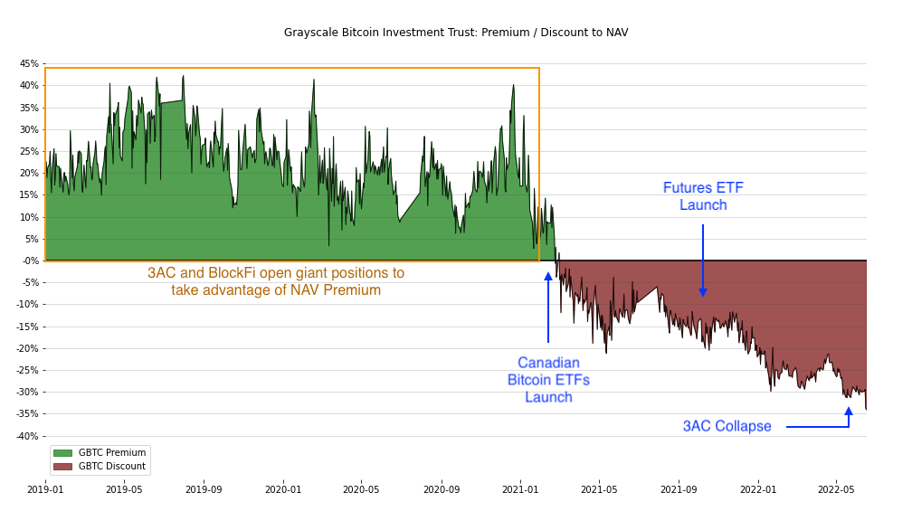

# Grayscale GBTC

This repository contains a Jupyter Notebook that demonstrates how to refresh stale data and keep up to date with market changes in the Grayscale Bitcoin Investment Trust net asset value divergence. 

